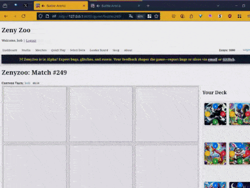

# Zenyzoo Django Project



---

## 🎥 Gameplay Video


Watch: [ZenyZoo Alpha Gameplay on YouTube](https://youtu.be/dDfyy3xtMiY)

*Note: Bot play is still buggy—two-player mode works! Feedback and fixes welcome!*

---

## Prerequisites

* **Python 3.10+**
* **Git**
* (Optional) **virtualenv** or built-in `venv`

---

## Installation

1. **Clone the repository**

   ```bash
   git clone https://github.com/your-org/zenyzoo.git
   cd zenyzoo
   ```

2. **Create & activate a virtual environment**

   ```bash
   python3 -m venv .venv
   source .venv/bin/activate
   ```

3. **Install dependencies**

   ```bash
   pip install --upgrade pip
   pip install -r requirements.txt
   ```

4. **Apply database migrations**

   ```bash
   python manage.py migrate
   ```

5. **Seed initial data (cards & players)**

   ```bash
   python manage.py seed_cards
   python manage.py seed_player_cards
   ```

6. **Create a superuser**

   ```bash
   python manage.py createsuperuser
   ```

7. **Collect static assets**

   ```bash
   python manage.py collectstatic --noinput
   ```

8. **Run the development server**

   ```bash
   python manage.py runserver
   ```

9. **Open in your browser**
   Visit [http://127.0.0.1:8000/game/](http://127.0.0.1:8000/game/) to register, select your deck, and start battling!

---

## Usage

* **Dashboard**:
  Create or join matches, view your profile & stats.

* **Select Deck**:
  Pick exactly 7 cards from your collection to form your battle deck.

* **Battle View**:
  Place cards on a 3×3 grid, flip adjacent enemy cards by strength.
  Play against another human or RandomBot (auto-moves after yours).

* **Shop**:
  Acquire new cards (if implemented); shop stub available.

* **Global Chat**:
  Chat in real-time with all online users (requires running Channels/ASGI; see [Real-Time & Chat](#real-time--chat)).

---

## Project Structure

```
zenyzoo/
├── core/                # Shared models/views
├── game/                # Main game app
│   ├── bots.py          # BotStrategy & RandomBot logic
│   ├── api_urls.py      # API endpoint routing
│   ├── urls.py          # HTML view routing
│   ├── consumers.py     # Channels/ASGI consumers (for chat/multiplayer)
│   ├── views/           # auth_views, api, match_views, game_views
│   ├── templates/       # HTML templates
│   ├── static/          # JS, CSS
│   └── utils.py         # Flip logic, deck initialization
├── zenyzoo/             # Project settings, asgi.py, wsgi.py
├── requirements.txt
└── manage.py
```

---

## Configuration

* **Settings**

  * `LOGIN_URL`, `LOGIN_REDIRECT_URL`, `LOGOUT_REDIRECT_URL` for auth flows.
  * `STATIC_ROOT` & `STATICFILES_DIRS` must point to your static assets.
  * `ASGI_APPLICATION = 'zenyzoo.asgi.application'` for Channels/websockets.
* **Environment Variables**

  * You can override `SECRET_KEY`, database credentials, etc., via a `.env` file or your OS.

---

## Real-Time & Chat

* **To enable global chat and real-time multiplayer:**

  1. Install Channels and Daphne:

     ```bash
     pip install channels daphne
     ```
  2. Run the ASGI server:

     ```bash
     daphne zenyzoo.asgi:application
     ```
  3. Open multiple browsers or tabs to test live chat and gameplay.

* See `game/consumers.py` and `game/templates/game/battle.html` for integration details.

---

## Notes & Tips

* **CSRF & AJAX**
  All `fetch()` calls in `static/game/js/` use `credentials: "same-origin"` and send `X-CSRFToken`. Ensure cookies are enabled.

* **Bot Matches**
  To challenge RandomBot, create an open match and click **Play vs Bot**. The bot uses the `RandomBot` strategy in `game/bots.py`.

* **Two-Player Testing**
  Register two users (in separate browsers/incognito windows) and have one join the other’s match.

* **Bug Fixes / Known Issues**

  * **Duplicate bot plays:** Ensure `RandomBot.choose_move` excludes already-used `PlayerCard` IDs.
  * **Template routing:** Separate HTML and API URLs, avoid DRF browsable templates for API endpoints.
  * **Polling/Board update:** Frontend polls board state after each move; no manual refresh needed.

---

## Testing & Debugging

* **Run checks**

  ```bash
  python manage.py check
  ```
* **Seed scripts**

  * `seed_cards` to populate Card entries from JSON.
  * `seed_player_cards` to assign card sets to players.

---

Feel free to extend this README with deployment, Docker, CI/CD, or environment-specific instructions as your project evolves. Good luck—and happy battling!

---


**Play the alpha now:** [https://zenyzoo-backend.onrender.com/game/matches/](https://zenyzoo-backend.onrender.com/game/matches/)

*Bugs? Feedback? DM or email—see Support below.*

